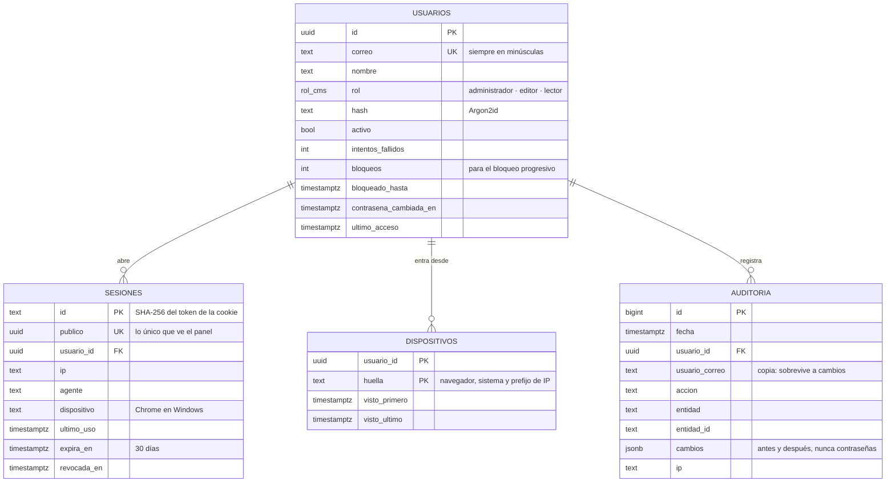

# Esquema de datos del CMS

La fuente de verdad son las migraciones SQL (`cms/api/src/db/migraciones`). Drizzle (`cms/api/src/db/esquema.ts`) solo tipa las consultas; las pruebas migran y consultan con él, así que si se desalinean, fallan.

## Fase 1: acceso

## Roles de base de datos

| Rol | Para qué | Sujeto a RLS |
|---|---|---|
| `cms_dueno` | Dueño del esquema. Solo lo usan las migraciones. | No (es el dueño) |
| `cms_app` | La aplicación. Sin `DELETE` en usuarios ni auditoría. | Sí |

Cada transacción de la aplicación declara su contexto: `app.rol` (`sistema`, `administrador`, `editor`, `lector`) y `app.usuario_id`. `sistema` es lo que ocurre antes de saber quién es: el inicio de sesión y la validación de la cookie.

## Políticas

| Tabla | Quién ve | Quién cambia |
|---|---|---|
| usuarios | Administrador y sistema: todas. Cada usuario: su fila. | Administrador y sistema: todo. Cada usuario: su nombre y su contraseña; un disparador impide que cambie su rol, su estado o su correo. Nadie borra. |
| sesiones | Administrador y sistema: todas. Cada usuario: las suyas. | Igual. |
| dispositivos | Solo sistema. | Solo sistema. |
| auditoria | Administrador: todo. Cada usuario: sus propios registros. | Solo inserción, con contexto. Nadie la edita ni la borra, tampoco un administrador. |

Todo esto está probado en `cms/api/test/rls.test.ts` directamente contra la base de datos, sin pasar por la API.
